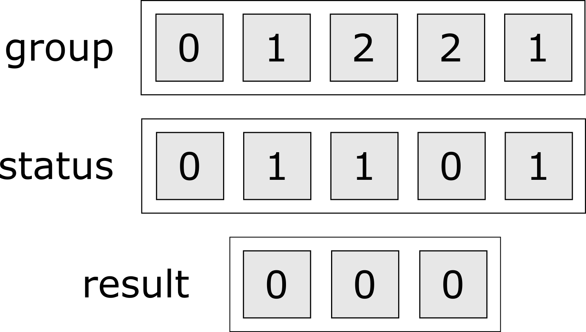
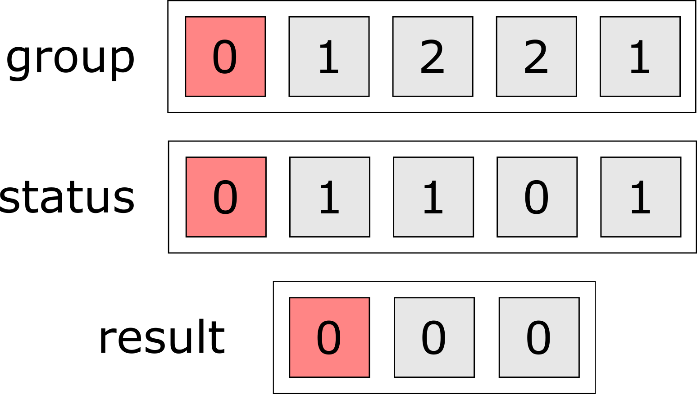
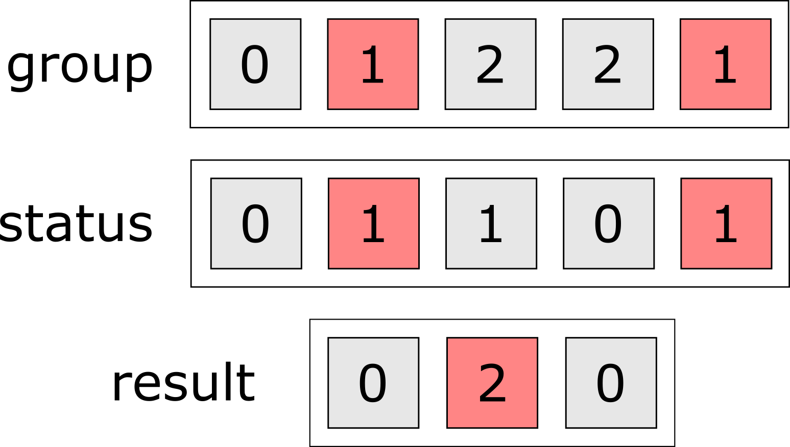
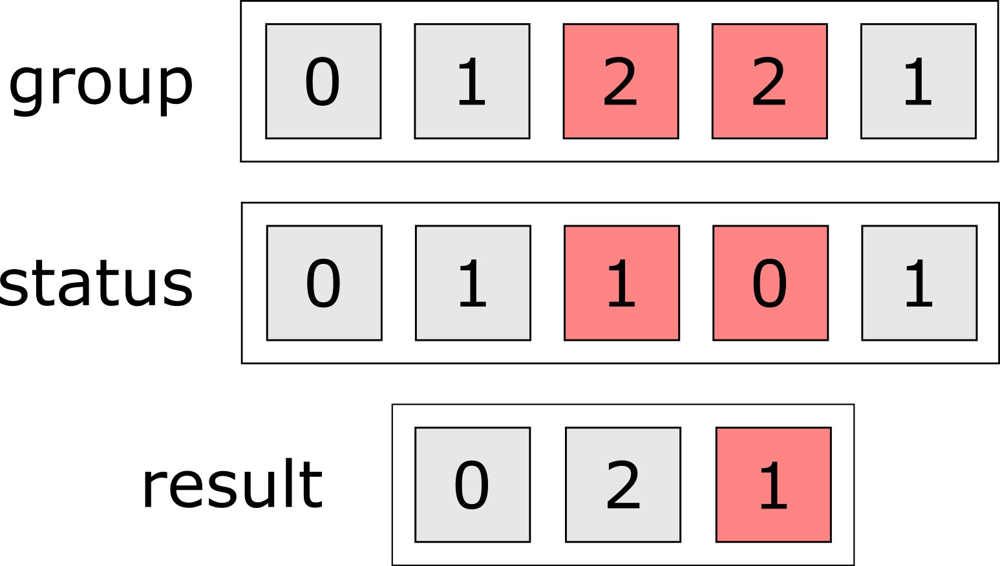
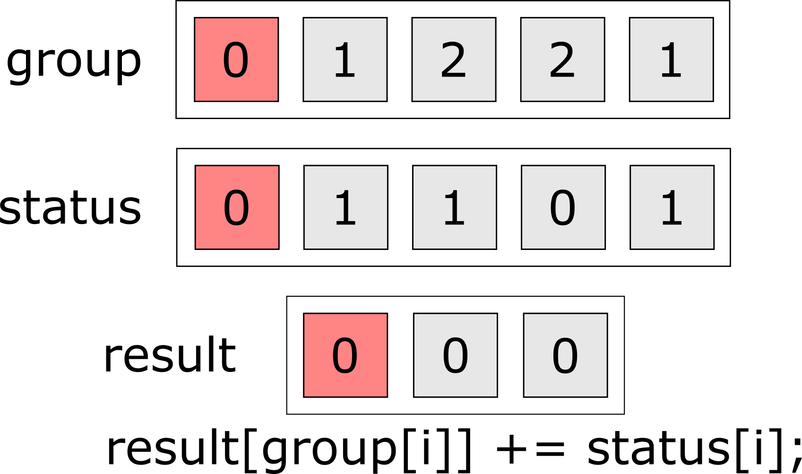
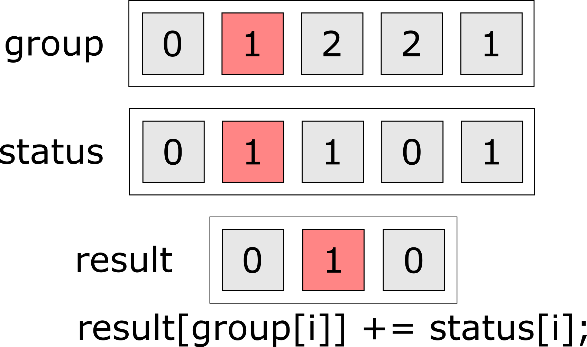
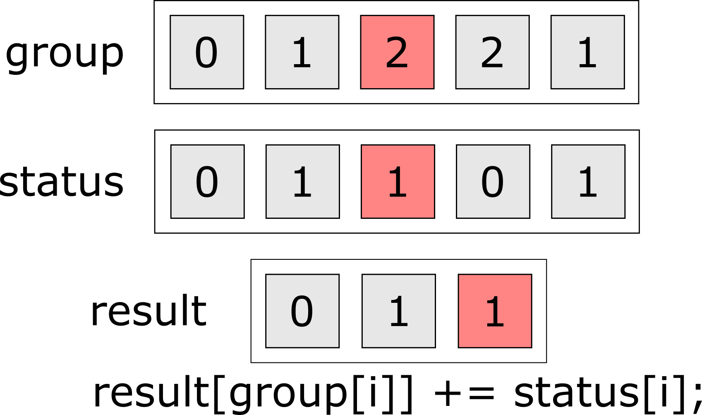
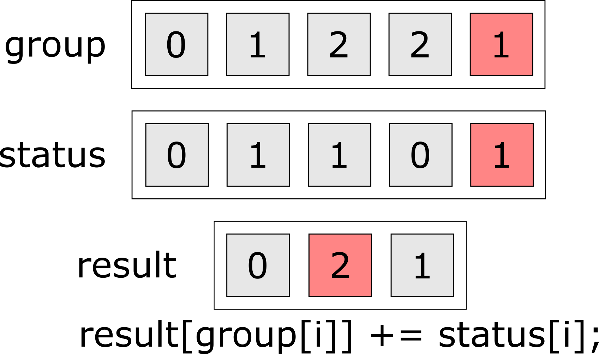

class: center, middle

```{r setup, include=FALSE}

options(htmltools.dir.version = FALSE)

library(magrittr)
library(gt)
library(dplyr)
library(purrr)
library(ggplot2)
library(Rcpp)
library(microbenchmark)
library(ggridges)
library(table.glue)
library(readr)

model_recoder <- c(
 'obliqueRSF-net' = 'obliqueRSF',
 'aorsf-fast' = 'aorsf',
 'rsf-standard' = 'randomForestSRC',
 'ranger-extratrees' = 'ranger',
 'cif-standard' = 'party'
)

time_fig_data <- read_rds("time_fig_data.rds") %>% 
 mutate(model = recode(model, !!!model_recoder))

medians <- read_rds("time_fig_medians.rds") %>% 
 mutate(
  model = recode(model, !!!model_recoder),
  color = recode(
   model,
   'obliqueRSF' = 'black',
   'aorsf' = 'white',
   'randomForestSRC' = 'white',
   'ranger' = 'white',
   'party' = 'black'
  ),
  vjust = -0.25
 )

eval_fig_data <- read_rds('eval_fig_data.rds') %>% 
 mutate(
  model = recode(model, !!!model_recoder),
  metric = recode(
   metric,
   "Scaled integrated Brier score" = 'Index of Prediction Accuracy',
   "Time-dependent C-statistic" = 'Concordance index'
  )
 ) %>% 
 filter(model != 'aorsf-cph',
        model != 'aorsf-net',
        model != 'aorsf-random') %>% 
 split(f = .$metric)

fig_subsets <- list(
 slide_one = c('obliqueRSF', 
               'randomForestSRC',
               'ranger', 
               'party'),
 slide_two = c('obliqueRSF', 
               'aorsf', 
               'randomForestSRC',
               'ranger', 
               'party')
)

fig_time_worker <- function(fig_time_data, medians){
 
 fig <- ggplot(fig_time_data) +
  aes(x = time, y = reorder(model, time, FUN=median),
      fill = model) +
  stat_density_ridges(
   quantile_lines = TRUE,
   quantiles = 0.5,
   bandwidth = 0.2,
   scale = 1
  ) +
  scale_x_log10(
   breaks = c(0.01, 0.1, 1, 10, 100, 1000, 10000),
   labels = c("0.01", "0.1", "1", "10", "100", "1,000", "10,000"),
   expand = c(0,0)
  ) +
  geom_text(
   data = medians,
   hjust = medians$hjust,
   vjust = medians$vjust,
   color = medians$color,
   aes(label = table_glue("{time}s"))
  ) +
  scale_fill_viridis_d() +
  theme_minimal() +
  theme(panel.grid.major.x = element_blank(),
        panel.grid.minor.x = element_blank(),
        panel.grid.major.y = element_blank(),
        panel.grid.minor.y = element_blank(),
        legend.position = '',
        axis.text = element_text(size = 18),
        axis.title = element_text(size = 15)) +
  labs(x = 'Time to fit a model and compute predictions, seconds',
       y = '')
 
 
}

fig_eval_worker <- function(fig_eval_data,  equiv_bound = 0.01){
 
 fig_eval_data$x <- seq(nrow(fig_eval_data), 1)
 
 xmax <- max(fig_eval_data$x)
 
 y_col_0 = -equiv_bound * 10
 y_col_1 = equiv_bound * 4
 y_col_2 = equiv_bound * 7
 y_col_3 = equiv_bound * 10
 
 y_breaks <- seq(-5, 1) * 1/100
 
 gg_header <- tibble(
  x = c(xmax + 1,
        xmax + 1,
        xmax + 2,
        xmax + 1,
        xmax + 1,
        xmax + 1),
  median = c(y_col_0,
             (min(y_breaks) + max(y_breaks)) / 2,
             (y_col_1 + y_col_3) / 2,
             y_col_1,
             y_col_2,
             y_col_3),
  label = c("Learner",
            as.character(fig_eval_data$metric[1]),
            "Posterior probability",
            "Equivalence",
            "Difference < 0",
            "Difference < -1"),
  hjust = c(0, 1/2, 1/2, 1/2, 1/2, 1/2)
 )
 
 gg_rect <- tibble(
  xmin = seq(xmax+1) - 1/2,
  xmax = seq(xmax+1) + 1/2,
  ymin = -Inf,
  ymax = Inf
 ) |>
  filter(seq(n()) %% 2 == 0)
 
 ggplot(fig_eval_data) +
  aes(x = x, y = median, label = model) +
  geom_segment(x = 0, y = -.01, xend = xmax+1/2, yend = -.01,
               color = 'purple', linetype = 2) +
  geom_segment(x = 0, y = .01, xend = xmax+1/2, yend = .01,
               color = 'purple', linetype = 2) +
  geom_segment(x = 0, y = 0, xend = xmax+1/2, yend = 0,
               color = 'darkorange', linetype = 2) +
  geom_vline(xintercept = c(xmax + 1/2, xmax + 3/2)) +
  geom_segment(
   mapping = aes(x = x,
                 y = ci_lwr,
                 xend = x,
                 yend = ci_upr),
   size = 0.75,
   color = 'grey80'
  ) +
  geom_segment(
   mapping = aes(x = x,
                 y = q25,
                 xend = x,
                 yend = q75),
   size = 2,
   color = 'grey60'
  ) +
  geom_rect(data = gg_rect,
            inherit.aes = FALSE,
            aes(xmin = xmin,
                xmax = xmax,
                ymin = ymin,
                ymax = ymax),
            fill = 'grey',
            alpha = 1/6) +
  geom_segment(x = 0, xend = 0,
               y = min(y_breaks), yend = max(y_breaks)) +
  geom_point(size = 3, color = 'darkorange') +
  geom_text(aes(y = y_col_0), hjust = 0) +
  geom_text(aes(x = x, y = y_col_1, label = prob_equiv)) +
  geom_text(aes(x = x, y = y_col_2, label = prob_super)) +
  geom_text(aes(x = x, y = y_col_3, label = prob_super_duper)) +
  geom_text(data = gg_header, aes(label = label, hjust = hjust)) +
  scale_y_continuous(limits = c(y_col_0, y_col_0*(-1)*1.25),
                     breaks = y_breaks,
                     labels = 100 * y_breaks,
                     expand = c(0, 0)) +
  scale_x_continuous(limits = c(0, xmax + 2.5),
                     expand = c(0, 0)) +
  coord_flip() +
  theme_bw() +
  labs(x = '', y = 'Difference versus aorsf, times 100') +
  theme(panel.grid = element_blank(),
        panel.border = element_blank(),
        axis.ticks.y = element_blank(),
        axis.text.y = element_blank(),
        axis.title.x = element_text(hjust = .31),
        legend.position = '')
 
}


figs_time <- fig_subsets %>%
 map(
  ~ fig_time_worker(
   fig_time_data = filter(time_fig_data, model %in% .x),
   medians = filter(medians, model %in% .x)
  )
 )

figs_eval <- eval_fig_data %>% 
 map(fig_eval_worker)


# draw with pencil on slides
# xaringanExtra::use_scribble()

# freeze gifs till you are on their slide
# xaringanExtra::use_freezeframe()

```

```{r, echo = FALSE}

# to make sourceCpp work from rmd
Sys.setenv(PATH = paste(Sys.getenv("PATH"), "C:\\rtools40\\usr\\bin", sep = ";"))
sourceCpp("src/count_events.cpp")

```


```{r xaringan-banner, echo=FALSE}

xaringanExtra::use_banner(
 top_left = "",
 top_right = "Byron C Jaeger",
 bottom_left = "byronjaeger.com/talk",
 exclude = c("inverse")
)

```


# (Bio)statisticians create methods that can engage with contemporary data and make valid conclusions

---
class: center, middle

# Statistical software allows these methods to be shared with investigators

---
## From proprietary to open-source

When SAS and SPSS were prominent, methods were shared by incorporating them into proprietary software.

--

As R and Python have become standard languages for data science, it has become more common for authors to write their own software for methods.

---

## obliqueRSF

In 2019, I made the `obliqueRSF` R package

- oblique random survival forests

--

`obliqueRSF` had higher prediction accuracy versus:

- `randomForestSRC`, 
- `ranger`,
- `party`. 

But was also hundreds of times slower.

---

```{r fig-time-one, fig.align = 'left', fig.height = 6, fig.width = 8, echo = FALSE, dpi = 300}
figs_time$slide_one
```

---
class: center, middle
background-image: url("img/meme_slow_R.jpg")
background-size: contain


---

```{r fig-time-two, fig.align = 'left', fig.height = 6, fig.width = 8, echo = FALSE, dpi = 300}
figs_time$slide_two
```

---

```{r fig-eval-cstat, fig.align = 'left', fig.height = 6.5, fig.width = 9, echo = FALSE, dpi = 300}
figs_eval$`Concordance index`
```

---

```{r fig-eval-ipa, fig.align = 'left', fig.height = 6.5, fig.width = 9, echo = FALSE, dpi = 300}
figs_eval$`Index of Prediction Accuracy`
```

---
background-image: url("img/aorsf-arxiv-paper.png")
background-size: 85%

## aorsf paper (https://arxiv.org/abs/2208.01129)

---
background-image: url("img/aorsf-arxiv-qr.png")
background-size: 65%

---
class: center, middle, inverse

# Four guidelines for faster code 

---
class: center, middle

# 1. Always be benchmarking

---
class: center, middle

# Why "always"? 

---
## How to benchmark?

__Step 1. Define a task:__ Count events per group (status of 1 $\Rightarrow$ event, 3 groups)

```{r}

# status = c(1, 0, 1, ...)
status = sample(x = c(0L, 1L), size = 1e5, replace = TRUE)

# group = c(2, 0, 1, ...)
group = sample(x = c(0L, 1L, 2L), size = 1e5, replace = TRUE)

```

--

__Step 2. Define the reference competitors__

```{r}

# competitors: table() and tapply()
table(status, group)[2, ] 

tapply(status, group, FUN = sum)

```

---

## How to benchmark?

__Step 3 (optional).__ Enter your own competitor(s)!

```{r, echo = FALSE}

```

---

## How to benchmark?

__Step 3 (optional).__ Enter your own competitor(s)!

```{r, echo = FALSE}

```

---

## How to benchmark?

__Step 3 (optional).__ Enter your own competitor(s)!

```{r, echo = FALSE}

```


---

## How to benchmark?

__Step 3 (optional).__ Enter your own competitor(s)!

```{r, echo = FALSE}

```


---

## How to benchmark?

__Step 3 (optional).__ Enter your own competitor(s)!

```{Rcpp, eval = FALSE}
#include <Rcpp.h>
using namespace Rcpp;

// [[Rcpp::export]]
NumericVector rcpp_count_dbl(NumericVector status,
                             NumericVector group,
                             int n_groups) {
 
 NumericVector out(n_groups);
 
 for( int i = 0; i < n_groups; i++ ){
  for( int j = 0; j < group.length(); j++ ){
   if(group[j] == i) out[i] += status[j];
  }
 }
 
 return(out);
}


```

---

## How to benchmark?

__Step 4. Off to the races:__

```{r, eval = FALSE}
library(microbenchmark)
microbenchmark(table = table(status, group)[2, ],
               tapply = tapply(status, group, FUN = sum),
               rcpp_count_dbl = rcpp_count_dbl(status, group, 3))
```

--

```{r, echo = FALSE}

library(table.glue)

bm <- readr::read_rds('benchmark.rds')

tbl_1 <- summary(bm) %>%
 select(-cld, -neval) %>%
 filter(expr %in% c("table",
                    "tapply",
                    "rcpp_count_dbl")) %>% 
 mutate(across(where(is.numeric), ~table_value(.x/1000))) %>%
 gt(rowname_col = 'expr') %>%
 tab_header(
  title = "Benchmark demonstration: counting events in groups",
  subtitle = "table(), tapply(), and rcpp_count_dbl()"
 ) %>%
 cols_label(min = 'Minimum',
            lq = '25th %',
            mean = 'Mean',
            median = 'Median',
            uq = '75th %',
            max = 'Maximum') %>%
 cols_align('center') %>%
 tab_stubhead(label = 'Function') %>%
 tab_spanner(columns = c("min", "lq", "mean", "median", "uq", "max"),
             label = "Time, milliseconds") %>% 
 tab_style(
  style = list(
   cell_fill(color = "#F9E3D6"),
   cell_text(style = "italic")
  ),
  locations = cells_body(
   columns = median
  )
 )

tbl_1

```


---
class: center, middle

# 2. Trace your data

---
## Trace your data

__Definition__ be notified when data are copied or cast to a different type

--

(Copying and casting require additional memory, slowing down your code.)

---
## How to trace?

Put the object you want to trace into `tracemem()`: 

```{r, results='hide'}

tracemem(status)
tracemem(group)

```

R will now notify you if `status` or `group` are copied or cast to a different type. 


---
## Here is a problem

`rcpp_count_dbl` casts both `status` and `group` from integer to double

```{r}
rcpp_count_dbl(status, group, n_groups = 3)
```

---
## Here is a problem

Our first `Rcpp` function expected numeric vectors. We gave it integers!

```{Rcpp, eval = FALSE}
#include <Rcpp.h>
using namespace Rcpp;

// [[Rcpp::export]]
NumericVector rcpp_count_dbl(NumericVector status, #<<
                             NumericVector group, #<<
                             int n_groups) {
 
 NumericVector out(n_groups); #<<
 
 for( int i = 0; i < n_groups; i++ ){
  for( int j = 0; j < group.length(); j++ ){
   if(group[j] == i) out[i] += status[j];
  }
 }
 
 return(out);
}


```

---
## Let's fix that

use __integerVector__ instead of __numericVector__

```{Rcpp, eval = FALSE}
#include <Rcpp.h>
using namespace Rcpp;

// [[Rcpp::export]]
IntegerVector rcpp_count_int(IntegerVector status, #<<
                             IntegerVector group, #<<
                             int n_groups) {
 
 IntegerVector out(n_groups); #<<
 
 for( int i = 0; i < n_groups; i++ ){
  for( int j = 0; j < group.length(); j++ ){
   if(group[j] == i) out[i] += status[j];
  }
 }
 
 return(out);
}

```


---
## Better

`tracemem()` has been pacified!

```{r}
rcpp_count_int(status, group, n_groups = 3)
```

---
class: center, middle

## Faster

```{r, echo = FALSE}

tbl_2 <- summary(bm) %>%
 select(-cld, -neval) %>%
 filter(expr %in% c("table",
                    "tapply",
                    "rcpp_count_dbl",
                    "rcpp_count_int")) %>% 
 mutate(across(where(is.numeric), ~table_value(.x/1000))) %>%
 gt(rowname_col = 'expr') %>%
 tab_header(
  title = "Benchmark demonstration: counting events in groups",
  subtitle = "table(), tapply(), and Rcpp functions"
 ) %>%
 cols_label(min = 'Minimum',
            lq = '25th %',
            mean = 'Mean',
            median = 'Median',
            uq = '75th %',
            max = 'Maximum') %>%
 cols_align('center') %>%
 tab_stubhead(label = 'Function') %>%
 tab_spanner(columns = c("min", "lq", "mean", "median", "uq", "max"),
             label = "Time, milliseconds") %>% 
 tab_style(
  style = list(
   cell_fill(color = "#F9E3D6"),
   cell_text(style = "italic")
  ),
  locations = cells_body(
   columns = median
  )
 )

tbl_2

```

---
class: center, middle

# 3. Count your operations

(Number of operations $\approx$ speed of your code)


---
## How to count

You don't have to be exact - think big picture 

---

## How to count

In our C++ function, we use $n$ operations for each unique value in `group`, 

```{r, echo = FALSE}

```

---
## How to count

In our C++ function, we use $n$ operations for each unique value in `group`, 


```{r, echo = FALSE}

```

---
## How to count

In our C++ function, we use $n$ operations for each unique value in `group`, 

```{r, echo = FALSE}

```

---
## How to count

In our C++ function, we use $n$ operations for each unique value in `group`, 

```{r, echo = FALSE}

```

---
## How to count

As $n, g \rightarrow \infty$, we use $\mathcal{O}(n \cdot g)$ operations, where $g$ = number of groups

--

Can we reduce the operation cost?

---
## 1 loop instead of 2

```{r, echo = FALSE}

```

---
## 1 loop instead of 2

```{r, echo = FALSE}

```

---
## 1 loop instead of 2

```{r, echo = FALSE}

```

---
## 1 loop instead of 2

```{r, echo = FALSE}
knitr::include_graphics('ink/vecs_8.png')
```

---
## 1 loop instead of 2

```{r, echo = FALSE}

```

---
## 1 loop instead of 2

code adapted from `rcpp_count_int`

```{Rcpp, eval = FALSE}
#include <Rcpp.h>
using namespace Rcpp;

// [[Rcpp::export]]
IntegerVector rcpp_count_1loop_int(IntegerVector status,
                                   IntegerVector group,
                                   int n_groups) {
 
 IntegerVector out(n_groups);
 IntegerVector::iterator i;
 int j = 0;
 
 for(i = group.begin() ; i != group.end(); ++i, ++j){
  out[*i] += status[j];
 }
 
 return(out);
}

```


---
class: center, middle

## Much faster!

```{r, echo = FALSE}

tbl_2 <- summary(bm) %>%
 select(-cld, -neval) %>%
 filter(expr %in% c("table",
                    "tapply",
                    "rcpp_count_dbl",
                    "rcpp_count_int",
                    "rcpp_count_1loop_int")) %>% 
 mutate(across(where(is.numeric), ~table_value(.x/1000))) %>%
 gt(rowname_col = 'expr') %>%
 tab_header(
  title = "Benchmark demonstration: counting events in groups",
  subtitle = "table(), tapply(), and Rcpp functions"
 ) %>%
 cols_label(min = 'Minimum',
            lq = '25th %',
            mean = 'Mean',
            median = 'Median',
            uq = '75th %',
            max = 'Maximum') %>%
 cols_align('center') %>%
 tab_stubhead(label = 'Function') %>%
 tab_spanner(columns = c("min", "lq", "mean", "median", "uq", "max"),
             label = "Time, milliseconds") %>% 
 tab_style(
  style = list(
   cell_fill(color = "#F9E3D6"),
   cell_text(style = "italic")
  ),
  locations = cells_body(
   columns = median
  )
 )

tbl_2

```


---
class: center, middle

# 4. Ride the Armadillo 

---
background-image: url("img/meme_aorsf_car.png")
background-size: 65%

---
background-image: url("img/arma.png")
background-size: 90%

## Armadillo (http://arma.sourceforge.net/)


---
## Armadillo

```{Rcpp, eval = FALSE}
#include <RcppArmadillo.h>
#include <RcppArmadilloExtensions/sample.h>
// [[Rcpp::depends(RcppArmadillo)]]
using namespace Rcpp;
using namespace arma;

// [[Rcpp::export]]
arma::ivec arma_count_1loop_int(arma::ivec& status,
                                arma::ivec& group,
                                arma::uword n_groups) {
 
 ivec out(n_groups);
 ivec::iterator i;
 uword j = 0;
 
 for(i = group.begin() ; i != group.end(); ++i, ++j){
  out[*i] += status[j];
 }
 
 return(out);
 
}

```

---
class: center, middle

## Better! (almost perfect)

```{r, echo = FALSE}

tbl_3 <- summary(bm) %>%
 select(-cld, -neval) %>%
 mutate(across(where(is.numeric), ~table_value(.x/1000))) %>%
 gt(rowname_col = 'expr') %>%
 tab_header(
  title = "Benchmark demonstration: counting events in groups",
  subtitle = "table(), tapply(), and Rcpp functions"
 ) %>%
 cols_label(min = 'Minimum',
            lq = '25th %',
            mean = 'Mean',
            median = 'Median',
            uq = '75th %',
            max = 'Maximum') %>%
 cols_align('center') %>%
 tab_stubhead(label = 'Function') %>%
 tab_spanner(columns = c("min", "lq", "mean", "median", "uq", "max"),
             label = "Time, milliseconds") %>% 
 tab_style(
  style = list(
   cell_fill(color = "#F9E3D6"),
   cell_text(style = "italic")
  ),
  locations = cells_body(
   columns = median
  )
 )

tbl_3

```


<!-- --- -->

<!-- ## aorsf -->

<!-- These guidelines were prominently used while I wrote `aorsf` -->

<!-- -- -->

<!-- 1. I ran benchmarks for each function -->

<!--     + made multiple versions to discover what worked best. -->
<!--     + learned a lot about C++ from this! -->

<!-- -- -->

<!-- 2. I used `tracemem` to discover unintentional copying -->

<!--     + Did you know `glmnet` makes a copy of its data? -->
<!--     + `obliqueRSF` calls `glmnet` hundreds if not thousands of times -->

<!-- -- -->

<!-- 3. I used Newton Raphson scoring instead of `glmnet` (__Fewer operations & no copying__). -->

<!-- -- -->

<!-- 4. Optimized with `RcppArmadillo` -->

---
class: inverse, center, middle

# Creating a Friendly API

---

## Names

__be consistent__: use _one_ convention throughout your package

- `snake_case`
- `camelCase`
- `SCREAMING_SNAKE`
- `ConFuse.EVERY_one` (don't do it)

Name functions with a __Noun__, then a __verb__, then __details__ (helps auto-completion & creates function families)

- `orsf_vi_negate()`, `orsf_vi_anova()`, `orsf_vi_permute()`
- `orsf_pd_ice()`, `orsf_pd_summary()`
- `orsf_control_cph()`, `orsf_control_net()`

__Exception:__ the modeling function is just the model name: 

- `lm()`
- `glm()`
- `orsf()`

---

## Check arguments

Vet inputs and write error messages that spark joy

```{r, error=TRUE}

library(aorsf)

orsf_fit <- orsf(data = pbc_orsf, 
                 formula = Surv(time, status) ~ one_variable) #<< 

```

---

## Check arguments

Vet inputs and write error messages that spark joy

```{r, error=TRUE}

pbc_orsf$date_var <- lubridate::today()
pbc_orsf$char_var <- "random"

orsf_fit <- orsf(data = pbc_orsf, #<< 
                 formula = Surv(time, status) ~ . ) 

```

```{r, echo = FALSE}

pbc_orsf$date_var <- NULL
pbc_orsf$char_var <- NULL

```

---

```{r, echo=FALSE}

orsf_fit <- pbc_orsf %>% 
 select(-id) %>%
 orsf(formula = Surv(time, status) ~ .)

```
 
## Generic methods

Include a generic `print` function (so your users won't hate you)

```{r}

print(orsf_fit)

```

---

```{r, echo=FALSE}

orsf_fit <- pbc_orsf %>% 
 select(-id) %>%
 orsf(formula = Surv(time, status) ~ ., n_tree = 1)

```


## Generic methods

Include a generic `print` function (so your users won't hate you)

```{r}

print(unclass(orsf_fit))

```

---

## Your guide to a friendly modeling package

[click here](https://tidymodels.github.io/model-implementation-principles/) to view this book from `tidymodels` online

```{r, echo = FALSE}
knitr::include_url("https://tidymodels.github.io/model-implementation-principles/index.html")
```

---

## Thank you!

Incredible team members: 

- `aorsf`: Sawyer Welden, Kristin Lenoir, Jaime L. Speiser, Matthew W. Segar, Ambarish Pandey, and Nicholas M. Pajewski

- today's talk: Jaime Lynn Speiser, Joseph Rigdon, Heather Marie Shappell, Nathaniel Sean O'Connell, and Michael Kattan.

--

Research reported in this presentation was supported<sup>1</sup> by 

- Center for Biomedical Informatics, Wake Forest University School of Medicine. 

- National Center for Advancing Translational Sciences (NCATS), National Institutes of Health, through Grant Award Number UL1TR001420. 

.footnote[
<sup>1</sup> The content is solely the responsibility of the authors and does not necessarily represent the official views of the NIH.
]


