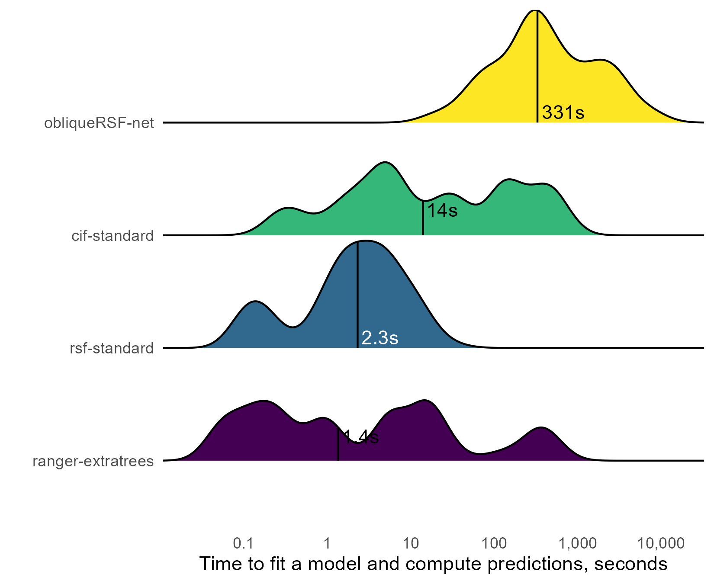
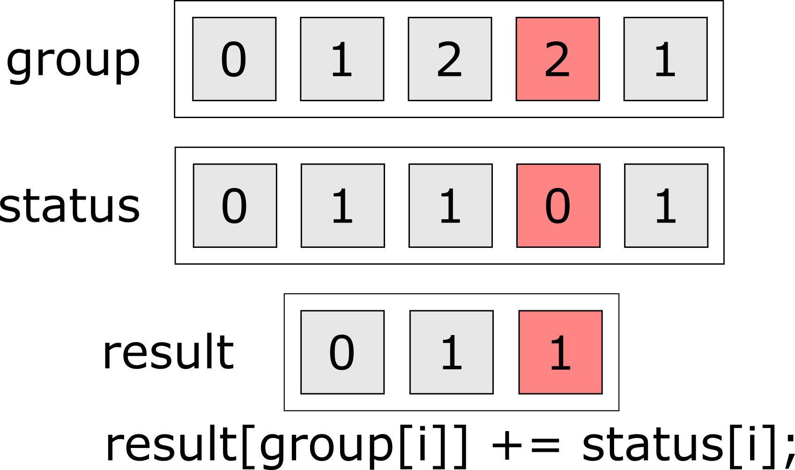

class: center, middle

```{r setup, include=FALSE}

options(htmltools.dir.version = FALSE)

library(magrittr)
library(gt)
library(dplyr)
library(Rcpp)
library(microbenchmark)

# draw with pencil on slides
# xaringanExtra::use_scribble()

# freeze gifs till you are on their slide
# xaringanExtra::use_freezeframe()

```

```{r, echo = FALSE}

# to make sourceCpp work from rmd
Sys.setenv(PATH = paste(Sys.getenv("PATH"), "C:\\rtools40\\usr\\bin", sep = ";"))
sourceCpp("src/count_events.cpp")

```


```{r xaringan-banner, echo=FALSE}

xaringanExtra::use_banner(
 top_left = "Sharing methods with R(cpp)",
 top_right = "Byron C Jaeger",
 bottom_left = "bit.ly/my-awesome-talk",
 exclude = c("inverse")
)

```


# Background

---
## obliqueRSF

In 2019, I made `obliqueRSF`, an R package to fit random survival forests using oblique recursive partitioning.

--

`obliqueRSF` had higher prediction accuracy versus:

- `randomForestSRC`, 

- `ranger`,

- `party`. 

- but was also hundreds of times slower.

---
class: center, middle
background-image: url("img/meme_slow_R.jpg")
background-size: contain

---

```{r, out.width='100%', echo = FALSE}

```

---

```{r, out.width='100%', echo = FALSE}

```


---
class: center, middle, inverse

# Four guidelines for faster code 

---
class: center, middle

# 1. Always be benchmarking

---
## Why benchmark?

- it gives you data on how fast your code runs

- it encourages you to write more modular functions (a good thing)


---
## How to benchmark?

__Step 1. Define a task:__ Count events per group (status of 1 $\Rightarrow$ event, 3 groups)

```{r}

# status = c(1, 0, 1, ...)
status = sample(x = c(0L, 1L), size = 1e5, replace = TRUE)

# group = c(2, 0, 1, ...)
group = sample(x = c(0L, 1L, 2L), size = 1e5, replace = TRUE)

```

__Step 2. Define the competitors__ (must give the same answer)

```{r}

# competitors: table() and tapply()
all(table(status, group)[2, ] == tapply(status, group, FUN = sum))

```

---

## How to benchmark?

__Step 2 contd.__ Enter your own competitor(s)!

```{r, echo = FALSE}
knitr::include_graphics('ink/vecs_1.png')
```

---

## How to benchmark?

__Step 2 contd.__ Enter your own competitor(s)!

```{r, echo = FALSE}

```

---

## How to benchmark?

__Step 2 contd.__ Enter your own competitor(s)!

```{r, echo = FALSE}

```


---

## How to benchmark?

__Step 2 contd.__ Enter your own competitor(s)!

```{r, echo = FALSE}

```


---

## How to benchmark?

__Step 2 contd.__ Enter your own competitor(s)!

```{Rcpp, eval = FALSE}
#include <Rcpp.h>
using namespace Rcpp;

// [[Rcpp::export]]
NumericVector rcpp_count_dbl(NumericVector status,
                             NumericVector group) {
 
 NumericVector group_uni = sort_unique(group);
 NumericVector out(group_uni.length());
 
 for( int i = 0; i < group_uni.length(); i++ ){
  for( int j = 0; j < group.length(); j++ ){
   if(group[j] == group_uni[i]) out[i] += status[j];
  }
 }
 
 return(out);
 
}

```

---

## How to benchmark?

__Step 2 contd.__ Enter your own competitor(s)!

```{Rcpp, eval = FALSE}
#include <Rcpp.h>
using namespace Rcpp;

// [[Rcpp::export]]
IntegerVector rcpp_count_int(IntegerVector status,
                             IntegerVector group) {
 
 IntegerVector group_uni = sort_unique(group);
 IntegerVector out(group_uni.length());
 
 for( int i = 0; i < group_uni.length(); i++ ){
  for( int j = 0; j < group.length(); j++ ){
   if(group[j] == group_uni[i]) out[i] += status[j];
  }
 }
 
 return(out);
 
}

```

---

## How to benchmark?

__Step 3. Off to the races:__

```{r, eval = FALSE}
library(microbenchmark)
microbenchmark(table = table(status, group)[2, ],
               tapply = tapply(status, group, FUN = sum),
               rcpp_count_dbl = rcpp_count_dbl(status, group),
               rcpp_count_int = rcpp_count_int(status, group))
```


```{r, echo = FALSE}

library(table.glue)

bm <- readr::read_rds('benchmark.rds')

tbl_1 <- summary(bm) %>%
 select(-cld, -neval) %>%
 filter(expr %in% c("table",
                    "tapply",
                    "rcpp_count_dbl",
                    "rcpp_count_int")) %>% 
 mutate(across(where(is.numeric), ~table_value(.x/1000))) %>%
 gt(rowname_col = 'expr') %>%
 tab_header(
  title = "Benchmark demonstration: counting events in groups",
  subtitle = "table(), tapply(), and Rcpp functions"
 ) %>%
 cols_label(min = 'Minimum',
            lq = '25th %',
            mean = 'Mean',
            median = 'Median',
            uq = '75th %',
            max = 'Maximum') %>%
 cols_align('center') %>%
 tab_stubhead(label = 'Function') %>%
 tab_spanner(columns = c("min", "lq", "mean", "median", "uq", "max"),
             label = "Time, milliseconds") %>% 
 tab_style(
  style = list(
   cell_fill(color = "#F9E3D6"),
   cell_text(style = "italic")
  ),
  locations = cells_body(
   columns = median
  )
 )

tbl_1

```


---
class: center, middle

# 2. Trace your data

---
## What do you mean by trace?

Tracing your data means being notified when 

- your data is copied

- your data are cast to a different type

## So, why trace?

Copying and casting require additional memory, slowing down your code.

---
## How to trace?

```{r}

data <- data.frame(x = 1:10)

tracemem(data)

```

No copies here

```{r}

# as of R 4.0, `data_2` and `data` share memory
data_2 <- data

```

---
## How to trace?

that is, until `data_2` is modified: 

```{r}

data_2$x[1] <- 10

```

Yikes! Not just one, but 2 memory messages

- Why the first message? `data_2` is no longer the same as `data`, so they can't share memory

- Why the second message? R assumes `10` is a double, so `x` is coerced from an integer vector to a double.

```{r}
# PS: don't forget to untrace
untracemem(data)
```

---
## So, who's copying data?

```{r}
tracemem(status)
tracemem(group)
```

---
## So, who's copying data?

```{r}
table(status, group)
```


---
## So, who's copying data?

```{r}
tapply(status, group, sum)
```

---
## So, who's copying data?

```{r}
rcpp_count_dbl(status, group, n_groups = 3)
```

---
## So, who's copying data?

```{r}
rcpp_count_int(status, group, n_groups = 3)
```

---

## This makes more sense now

```{r, echo = FALSE}
tbl_1
```

---
class: center, middle

# 3. Count your operations

---
## Why count operations?

Number of operations $\approx$ computational cost of your code

## How to count

You don't have to be exact, just write the main ideas 

---
## Example

In our C++ function, we use $n$ operations for each unique value in `group`, 

```{r, echo = FALSE}
knitr::include_graphics('ink/vecs_1.png')
```

---
## Example

In our C++ function, we use $n$ operations for each unique value in `group`, 


```{r, echo = FALSE}

```

---
## Example

In our C++ function, we use $n$ operations for each unique value in `group`, 

```{r, echo = FALSE}

```

---
## Example

In our C++ function, we use $n$ operations for each unique value in `group`, 

```{r, echo = FALSE}

```

---
## Example

As $n, g \rightarrow \infty$, we use $\mathcal{O}(n \cdot g)$ operations, where $g$ = number of groups

Can we reduce the operation cost?

- Can't remove the sum, so we have at least $n$ operations.

- Can we sum by group without finding group indices? That would drop $g$ from our operation count

Yes, because the group indices are given to us by the group vector.

---
## 1 loop instead of 2

```{r, echo = FALSE}
knitr::include_graphics('ink/vecs_5.png')
```

---
## 1 loop instead of 2

```{r, echo = FALSE}
knitr::include_graphics('ink/vecs_6.png')
```

---
## 1 loop instead of 2

```{r, echo = FALSE}

```

---
## 1 loop instead of 2

```{r, echo = FALSE}

```

---
## 1 loop instead of 2

```{r, echo = FALSE}
knitr::include_graphics('ink/vecs_9.png')
```

---
## 1 loop instead of 2

```{r, echo = FALSE}

tbl_2 <- summary(bm) %>%
 select(-cld, -neval) %>%
 filter(expr %in% c("table",
                    "tapply",
                    "rcpp_count_dbl",
                    "rcpp_count_int",
                    "rcpp_count_1loop_int")) %>% 
 mutate(across(where(is.numeric), ~table_value(.x/1000))) %>%
 gt(rowname_col = 'expr') %>%
 tab_header(
  title = "Benchmark demonstration: counting events in groups",
  subtitle = "table(), tapply(), and Rcpp functions"
 ) %>%
 cols_label(min = 'Minimum',
            lq = '25th %',
            mean = 'Mean',
            median = 'Median',
            uq = '75th %',
            max = 'Maximum') %>%
 cols_align('center') %>%
 tab_stubhead(label = 'Function') %>%
 tab_spanner(columns = c("min", "lq", "mean", "median", "uq", "max"),
             label = "Time, milliseconds") %>% 
 tab_style(
  style = list(
   cell_fill(color = "#F9E3D6"),
   cell_text(style = "italic")
  ),
  locations = cells_body(
   columns = median
  )
 )

tbl_2

```


---
class: center, middle

# 4. Ride the Armadillo 

---

## Armadillo

(http://arma.sourceforge.net/)

```{r out.width='100%', echo = FALSE}

knitr::include_url("http://arma.sourceforge.net/")

```

---
## Armadillo

Faster memory access and low-level parallelization 

```{r, echo = FALSE}

tbl_3 <- summary(bm) %>%
 select(-cld, -neval) %>%
 mutate(across(where(is.numeric), ~table_value(.x/1000))) %>%
 gt(rowname_col = 'expr') %>%
 tab_header(
  title = "Benchmark demonstration: counting events in groups",
  subtitle = "table(), tapply(), and Rcpp functions"
 ) %>%
 cols_label(min = 'Minimum',
            lq = '25th %',
            mean = 'Mean',
            median = 'Median',
            uq = '75th %',
            max = 'Maximum') %>%
 cols_align('center') %>%
 tab_stubhead(label = 'Function') %>%
 tab_spanner(columns = c("min", "lq", "mean", "median", "uq", "max"),
             label = "Time, milliseconds") %>% 
 tab_style(
  style = list(
   cell_fill(color = "#F9E3D6"),
   cell_text(style = "italic")
  ),
  locations = cells_body(
   columns = median
  )
 )

tbl_3

```

